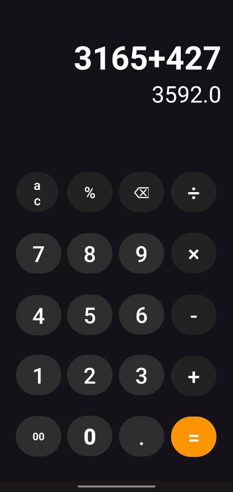

# Calculator — Android Studio (Java)

A simple, native Android calculator app built with Java in Android Studio. This repository contains the source code for a basic calculator that demonstrates typical arithmetic operations, a clear UI, and state handling across device rotations.

Languages: Java (100%)

## Features

- Standard calculator in portrait orientation.
- Scientific calculator that appears automatically in landscape orientation (no manual switch).
- Basic arithmetic: addition, subtraction, multiplication, division.
- Correct operator precedence (× and ÷ are evaluated before + and -).
- Decimal support.
- Percentage, decimal point, and backspace (⌫) support.
- Clear (C) and All Clear (AC).
- Trigonometric functions: sin, cos, tan, sin⁻¹, cos⁻¹, tan⁻¹.
- Logarithms: ln, log.
- Powers and roots: x², xʸ, √.
- Constants: π, e.
- Factorial (n!), reciprocal (1/x), and sign toggle (±).
- Parentheses and RAD/DEG angle mode.
- Responsive layouts for compact and regular phone screens.
- Premium light and dark themes with a clear button hierarchy (only the equals key uses the orange accent).
- Preserves the current calculation across device rotation.

## Screenshots

(Add screenshots to the `docs/` folder or the repository root and reference them here.)

Example:


---

## Getting started

### Requirements

- Android Studio (Arctic Fox or later recommended)
- JDK 21+ (project configured with a compatible toolchain)
- Android SDK (compileSdk 35)
- A device or emulator running Android (minSdk 25)

## Build and run

Open the project in Android Studio:

1. File → Open... → select the project's root folder.
2. Let Android Studio sync and download dependencies.
3. Select a target device (emulator or physical device).
4. Run (Shift+F10 or the Run ▶ button).

## Project structure

- `app/src/main/java/com/example/calculator/MainActivity.java` — UI wiring
- `app/src/main/java/com/example/calculator/CalculatorEngine.java` — pure calculation logic (no Android dependencies)
- `app/src/main/res/layout/activity_main.xml` — portrait (standard) layout
- `app/src/main/res/layout-land/activity_main.xml` — landscape (scientific) layout
- `app/src/test/java/com/example/calculator/CalculatorEngineTest.java` — unit tests

## Building from the command line

Debug build:

```bash
./gradlew assembleDebug
```

Release build (requires a configured release signing key — see below):

```bash
./gradlew assembleRelease
```

## Running the tests

```bash
./gradlew testDebugUnitTest
```

## Release signing

The release build reads signing details from environment variables so that
credentials are never committed to the repository:

- `RELEASE_STORE_FILE` — absolute path to the release keystore (.jks)
- `RELEASE_KEY_ALIAS` — key alias
- `RELEASE_STORE_PASSWORD` — keystore password
- `RELEASE_KEY_PASSWORD` — key password

Alternatively, place `storeFile`, `keyAlias`, `storePassword`, and `keyPassword`
in the git-ignored `local.properties` and they will be picked up automatically.

## App usage

- Tap numeric buttons to enter numbers.
- Tap arithmetic operator buttons (+, −, ×, ÷) to build an expression.
- Tap `=` to evaluate.
- Use `C` to clear the current entry and `AC` to reset all.
- Rotate the device to landscape to access scientific functions automatically.

## Download

Prebuilt, signed APKs are published on the
[GitHub Releases](https://github.com/GDJ2001/Calculator-Android-Studios/releases)
page. The current stable version is **1.0** (tag `v1.0.0`).

---

## Error handling

- Division by zero displays an error message or resets the current operation (implementation-specific).
- Invalid input is sanitized where applicable.

## Contributing

Contributions are welcome. Please follow these steps:

1. Fork the repository.
2. Create a feature branch: `git checkout -b feature/your-feature`
3. Make your changes and commit: `git commit -m "Add feature"`
4. Push to your fork: `git push origin feature/your-feature`
5. Open a Pull Request describing your changes.

Please include:
- A clear description of the change
- The devices / API levels you tested on
- Screenshots (if UI changes)


## Contact

Maintainer: GDJ2001
Repository: https://github.com/GDJ2001/Calculator-Android-Studios
